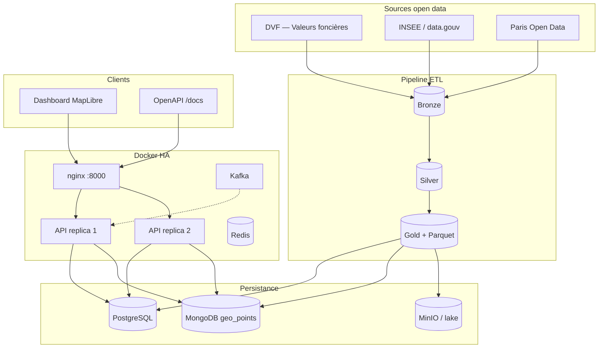
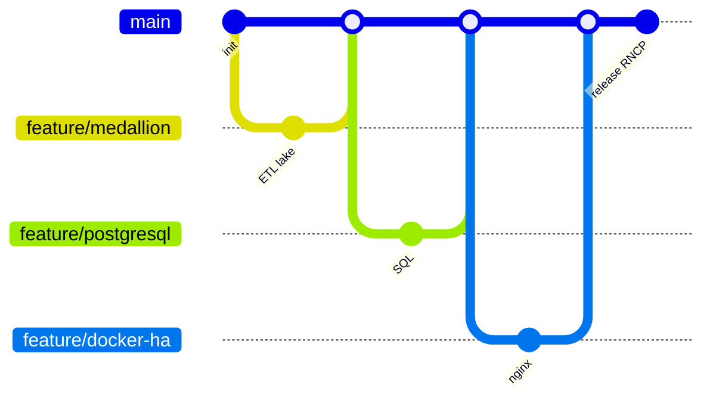

# Urban Data Explorer

[](https://www.python.org/)
[](https://fastapi.tiangolo.com/)
[](https://www.postgresql.org/)
[](https://www.mongodb.com/)
[](https://docs.docker.com/compose/)
[](LICENSE)
[](VALIDATION_RNCP.md)

Dashboard web interactif avec carte choroplèthe pour **comparer le marché immobilier et les indicateurs urbains des 20 arrondissements parisiens**.

## Équipe

| Membre | Rôle | GitHub |
|--------|------|--------|
| **Estelle Letourneur** | Architecture data, API, documentation | [@Pandyyyyyyy](https://github.com/Pandyyyyyyy) |
| **Nathan Lamtara** | ETL, PostgreSQL, infrastructure | [@nathan7836](https://github.com/nathan7836) |
| **Kilian Ngog** | Intégrations open data, exports, tests | [@KahessLacessProduction](https://github.com/kahesslacessproduction) |
| **Thomas Soubirou-Pouey** | Dashboard, MongoDB, streaming | [@totosoubi](https://github.com/totosoubi) |

## Fonctionnalités

- **Architecture Medallion** (Bronze → Silver → Gold)
- **API REST FastAPI** — 36 routes documentées (`/docs`)
- **Dashboard interactif** — carte choroplèthe MapLibre + Chart.js
- **11 indicateurs** : Prix/m², Évolution, Logements sociaux, Loyers, Accessibilité, Tension locative, Pollution, Délits, Revenus, Densité, Végétation, Transports
- **Haute disponibilité** — 2 réplicas API derrière nginx
- **Export multi-formats** (CSV, Parquet, GeoJSON)
- **Pipeline batch** automatisé (GitHub Actions)

## Architecture



## Installation

```bash
pip install -r requirements.txt
python pipeline.py
python scripts/sync_platform.py
python run.py
```

Dashboard : [http://localhost:8001/dashboard/](http://localhost:8001/dashboard/)

**Stack complète** :

```bash
docker compose up -d
curl http://localhost:8000/health
python scripts/validate_rncp.py
```

## Structure du projet

```
UrbanDataExplorer/
├── Data/                    # Medallion (bronze / silver / gold / export)
├── dashboard/               # Frontend MapLibre
├── database/                # Schéma PostgreSQL
├── nginx/                   # Load balancer HA
├── ude_platform/            # Sync, lake, streaming, sécurité
├── services/                # Consumers Kafka / Redis
├── scripts/                 # sync, demo, validation RNCP
├── tests/                   # pytest
├── api.py                   # FastAPI
├── pipeline.py              # Orchestration ETL
└── docker-compose.yml
```

## API (aperçu)

| Endpoint | Description |
|----------|-------------|
| `GET /arrondissements` | Liste complète enrichie |
| `GET /prix?annee=2024` | Prix par année |
| `GET /comparaison?arr1=1&arr2=6` | Comparaison deux arrondissements |
| `GET /timeline?arr=6` | Évolution temporelle |
| `GET /bdd/relationnelle` | Preuve compétence SQL |
| `GET /bdd/non-relationnelle` | Preuve compétence NoSQL |
| `GET /health` | Santé services + fraîcheur |

Documentation : [http://localhost:8001/docs](http://localhost:8001/docs)

## Indicateurs

| Catégorie | Indicateurs |
|-----------|-------------|
| **Marché** | Prix/m² (DVF), loyers encadrés, évolution |
| **Social** | Logements sociaux (RPLS), accessibilité, tension locative |
| **Environnement** | Pollution (ATMO), végétation |
| **Territoire** | Délits, revenus Filosofi, densité, transports RATP |

## Sources de données

| Source | Données |
|--------|---------|
| DVF (data.gouv) | Transactions immobilières |
| OpenData Paris | Loyers, végétation, transports, qualité de l'air |
| SSMSI | Délinquance communale |
| Filosofi | Revenus des ménages |
| RPLS | Logements sociaux |

## Workflow Git

Développement en **branches `feature/*`** fusionnées sur `main` :



## Documentation projet

| Document | Contenu |
|----------|---------|
| [VALIDATION_RNCP.md](VALIDATION_RNCP.md) | 8 compétences RNCP |
| [SYNTHESE_ECARTS.md](SYNTHESE_ECARTS.md) | Checklist soutenance |
| [BDD_RELATIONNELLE.md](BDD_RELATIONNELLE.md) | PostgreSQL |
| [BDD_NON_RELATIONNELLE.md](BDD_NON_RELATIONNELLE.md) | MongoDB |
| [DATA_LAKE.md](DATA_LAKE.md) | Medallion + Parquet |
| [RGPD.md](RGPD.md) | Conformité RGPD |

## Licence

[MIT](LICENSE)
